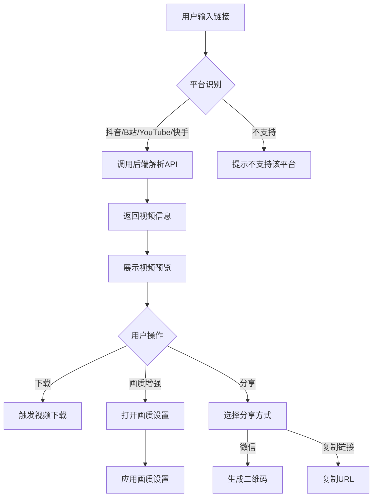

## 1. Product Overview
视频提取器是一款在线工具，帮助用户从抖音、B站、YouTube、快手等主流视频平台提取视频内容，支持视频下载、画质增强和微信分享功能。
- 解决用户无法直接下载平台视频的痛点，提供一站式视频处理服务
- 目标用户：需要获取平台视频资源的普通用户、内容创作者、自媒体从业者

## 2. Core Features

### 2.1 User Roles
| Role | Registration Method | Core Permissions |
|------|---------------------|------------------|
| 普通用户 | 邮箱/手机号注册、第三方登录 | 提取视频、下载视频、分享视频、使用画质增强功能、查看提取历史 |

### 2.2 Feature Module
1. **首页**：视频链接输入、平台标识、视频提取、视频预览、视频下载
2. **画质增强**：分辨率选择、帧率选择、画质增强应用
3. **分享功能**：微信分享（二维码）、复制链接
4. **用户中心**：提取历史记录、用户信息管理

### 2.3 Page Details
| Page Name | Module Name | Feature description |
|-----------|-------------|---------------------|
| 首页 | 链接输入区 | 输入视频链接，自动识别平台，点击提取按钮 |
| 首页 | 视频预览区 | 展示提取后的视频，显示视频信息（标题、时长、分辨率、帧率） |
| 首页 | 操作按钮 | 下载视频、画质增强、分享按钮 |
| 画质增强 | 画质选项 | 高清/超清/蓝光三种预设，自定义分辨率和帧率 |
| 分享 | 分享选项 | 微信好友（生成二维码）、复制链接 |
| 用户中心 | 历史记录 | 查看和管理过去提取的视频记录 |

## 3. Core Process

### 视频提取流程
1. 用户输入视频链接 → 系统识别平台 → 点击提取
2. 系统调用后端API解析视频 → 返回视频信息和下载链接
3. 展示视频预览 → 用户可下载/画质增强/分享

### 画质增强流程
1. 用户点击画质增强 → 选择预设或自定义参数
2. 系统应用画质设置 → 更新视频信息显示

### 分享流程
1. 用户点击分享 → 选择微信或复制链接
2. 微信分享：生成二维码 → 用户扫码分享
3. 复制链接：复制当前页面URL到剪贴板

## 4. User Interface Design

### 4.1 Design Style
- **主色调**：深紫色系（#0f172a 背景，#6366f1 主色，#8b5cf6 次色）
- **按钮风格**：圆角矩形，渐变色，悬停发光效果
- **字体**：系统字体（-apple-system, BlinkMacSystemFont），清晰易读
- **布局**：卡片式布局，顶部导航，响应式设计
- **图标**：SVG矢量图标，简洁现代

### 4.2 Page Design Overview
| Page Name | Module Name | UI Elements |
|-----------|-------------|-------------|
| 首页 | 头部区域 | 渐变标题、平台标签、描述文字 |
| 首页 | 输入区域 | 输入框、提取按钮、进度条 |
| 首页 | 视频区域 | 视频播放器、视频信息标签、操作按钮 |
| 画质增强 | 设置区域 | 画质选项卡片、分辨率下拉框、帧率下拉框、应用按钮 |
| 分享 | 分享区域 | 分享选项卡片、二维码容器 |

### 4.3 Responsiveness
- 桌面优先设计，支持响应式布局
- 移动端：输入框和按钮垂直排列，卡片宽度自适应屏幕
- 触控优化：按钮尺寸适合手指点击，交互反馈明显