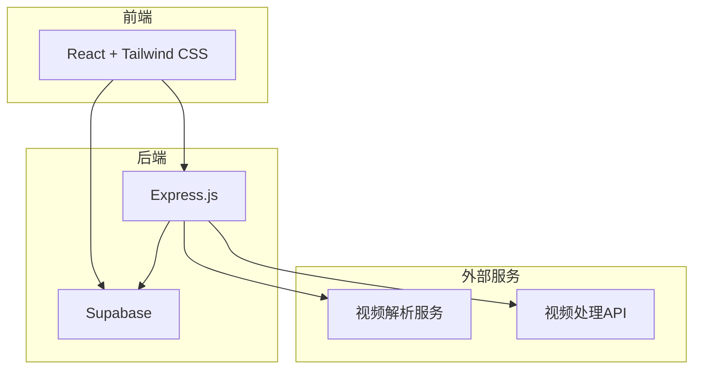
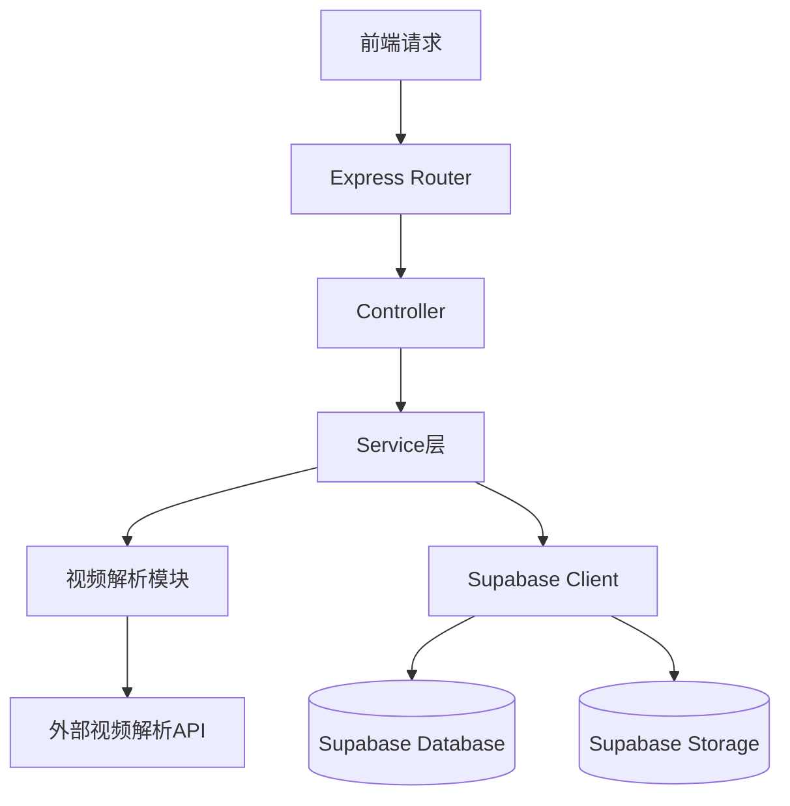
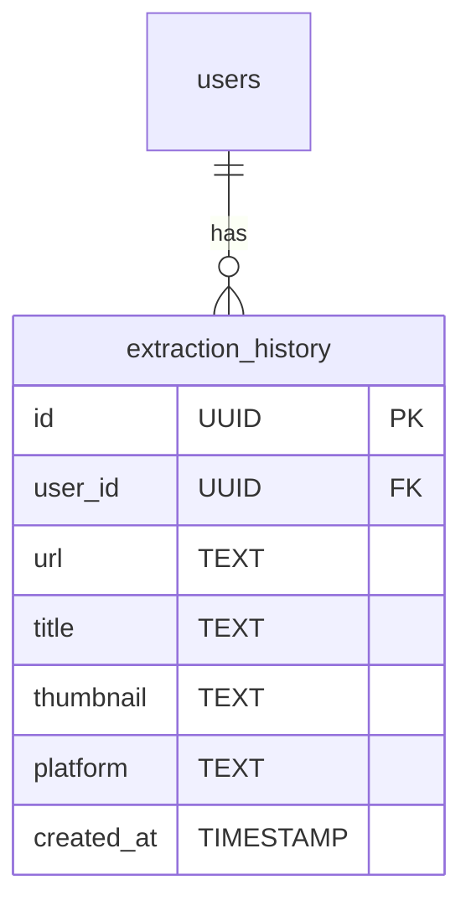

## 1. Architecture Design



## 2. Technology Description
- **Frontend**: React@18 + TailwindCSS@3 + Vite@6
- **Initialization Tool**: vite-init
- **Backend**: Express@4 + Supabase
- **Database**: Supabase (PostgreSQL)
- **Storage**: Supabase Storage
- **Authentication**: Supabase Auth
- **Video Parsing**: 自建Node.js后端 + 视频解析库
- **Video Processing**: FFmpeg (可选)

## 3. Route Definitions

### Frontend Routes
| Route | Purpose |
|-------|---------|
| `/` | 首页，视频提取主功能 |
| `/history` | 提取历史记录页面 |
| `/profile` | 用户个人中心 |

### Backend API Routes
| Route | Method | Purpose |
|-------|--------|---------|
| `/api/extract` | POST | 解析视频链接，返回视频信息 |
| `/api/download` | GET | 获取视频下载链接 |
| `/api/history` | GET | 获取用户提取历史 |
| `/api/history` | POST | 保存提取记录 |
| `/api/history/:id` | DELETE | 删除提取记录 |

## 4. API Definitions

### POST /api/extract
**Request:**
```typescript
interface ExtractRequest {
    url: string;
}
```

**Response:**
```typescript
interface ExtractResponse {
    success: boolean;
    message: string;
    video?: {
        id: string;
        title: string;
        duration: string;
        resolution: string;
        fps: number;
        thumbnail: string;
        downloadUrl: string;
        platform: string;
    };
}
```

### GET /api/history
**Request:**
- Headers: `Authorization: Bearer <access_token>`

**Response:**
```typescript
interface HistoryResponse {
    success: boolean;
    data: Array<{
        id: string;
        url: string;
        title: string;
        thumbnail: string;
        platform: string;
        createdAt: string;
    }>;
}
```

### POST /api/history
**Request:**
```typescript
interface HistoryRequest {
    url: string;
    title: string;
    thumbnail: string;
    platform: string;
}
```

**Response:**
```typescript
interface HistoryResponse {
    success: boolean;
    id: string;
}
```

### DELETE /api/history/:id
**Request:**
- Headers: `Authorization: Bearer <access_token>`

**Response:**
```typescript
interface DeleteResponse {
    success: boolean;
    message: string;
}
```

## 5. Server Architecture Diagram



## 6. Data Model

### 6.1 Data Model Definition



### 6.2 Data Definition Language

**extraction_history 表:**
```sql
CREATE TABLE extraction_history (
    id UUID PRIMARY KEY DEFAULT uuid_generate_v4(),
    user_id UUID REFERENCES auth.users(id),
    url TEXT NOT NULL,
    title TEXT,
    thumbnail TEXT,
    platform TEXT,
    created_at TIMESTAMP DEFAULT CURRENT_TIMESTAMP
);

CREATE INDEX idx_extraction_history_user_id ON extraction_history(user_id);
CREATE INDEX idx_extraction_history_created_at ON extraction_history(created_at);

GRANT SELECT ON extraction_history TO anon;
GRANT ALL PRIVILEGES ON extraction_history TO authenticated;

CREATE POLICY "Users can view their own extraction history"
    ON extraction_history FOR SELECT
    USING (auth.uid() = user_id);

CREATE POLICY "Users can insert their own extraction history"
    ON extraction_history FOR INSERT
    WITH CHECK (auth.uid() = user_id);

CREATE POLICY "Users can delete their own extraction history"
    ON extraction_history FOR DELETE
    USING (auth.uid() = user_id);
```

## 7. Supabase Configuration

### 7.1 Auth Settings
- 启用邮箱/密码认证
- 启用Google/Facebook第三方登录（可选）
- 设置JWT过期时间

### 7.2 Storage Settings
- 创建 `videos` bucket 用于存储视频文件
- 创建 `thumbnails` bucket 用于存储缩略图
- 设置访问权限：公开读取，认证用户写入

### 7.3 Edge Functions（可选）
- 用于简单的数据处理和验证
- 注意执行时间限制（免费版150秒）